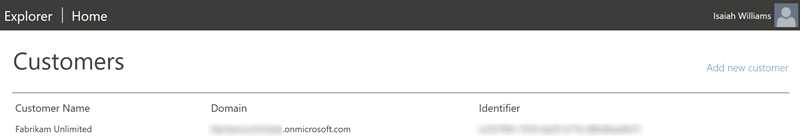
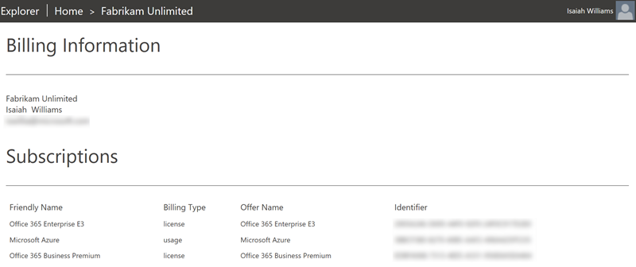
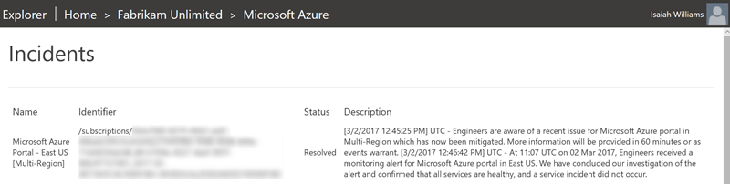

# Partner Center Explorer

 
Partner Center Explorer is an open source project that demonstrates how you can 
utilizes various techologies to support Cloud Solution Provider customers. This 
project enables you (the partner), customers, and end-users the ability to manage 
various resources. The primary purpose of this solution is to educate you on what 
is possible and how it can be accomplished.
 
This project is being provided with community support only. If you need help please,
log an issue using the [issue tracker](https://github.com/Microsoft/Partner-Center-Explorer/issues).
 
## Deployment
Please see the [deployment guide](docs/Deployment.md) for details on how to deploy this project.

 
## Screenshots
The following are various screenshots that should help provide a better
understanding of what this project provides
 

 

 

 
## Code of Conduct 
This project has adopted the [Microsoft Open Source Code of Conduct](https://opensource.microsoft.com/codeofconduct/). For more 
information see the [Code of Conduct FAQ](https://opensource.microsoft.com/codeofconduct/faq/) or contact 
[opencode@microsoft.com](mailto:opencode@microsoft.com) with any additional questions or comments.
 
## License
Copyright (c) Microsoft Corporation. All rights reserved.
 
Licensed under the [MIT](LICENSE) License.
