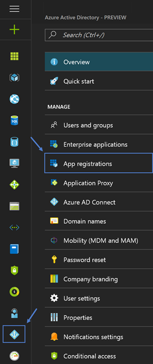
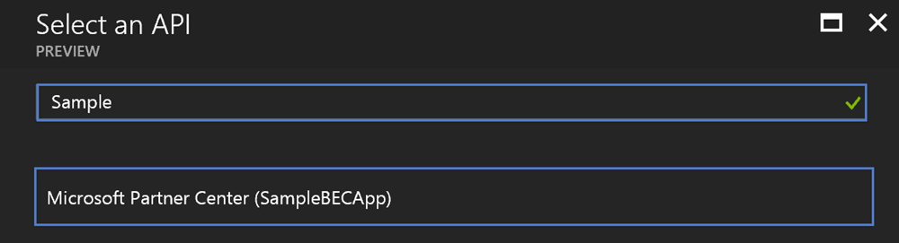
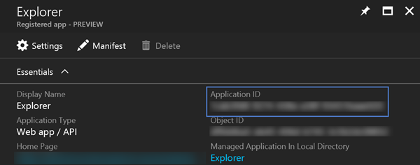

# Deploying Partner Center Explorer
Partner Center Explorer has been designed in such a way that it can be deployed 
on Azure or on premise. There are various features, such as caching access token
using Redis Cache, that require different Azure service to be deployed. If these
services are not deployed then the corresponding features will not be utilized.

The remaining sections of this guide will walkthrough how to deploy the project.   

## Prerequisites 
The following are _optional_ prerequisites for this sample project 

| Prerequisite          | Purpose                                                                                                                             |
|-----------------------|-------------------------------------------------------------------------------------------------------------------------------------|
|  Azure Subscription   | A subscription is only required if you want to host the sample in Azure and utilize the Power BI Embedded and Redis Cache features. |

The following are _required_ prerequisites for this sample project

| Prerequisite                            | Purpose                                                                                                           |
|-----------------------------------------|-------------------------------------------------------------------------------------------------------------------|
|  Azure AD global admin privileges       | Required to create the required Azure AD application utilized to obtain access tokens.                            |
|  Partner Center admin agent privileges  | Required to perform various Partner Center operations through the Partner Center API.                             |

## Azure Key Vault
Azure Key Vault is utilized by this project to protect application secrets and 
various connection strings. It is not required that this service by deployed, 
however, it is highly recommend that you utilize this service to protect this 
sensitive information.

If you would like to utilize Azure Key Vault then please follows the steps outlined
in the [Azure Key Vault](KeyVault.md) documentation.

## Partner Center Azure AD Application
App only authentication is utilized when performing various operations using the 
Partner Center API. In order to obtain the necessary access token to perform 
these operations an applicaiton needs to be registered in the Partner Center 
portal. Perform the following to create, if necessary, and register the required 
application

1. Login into the [Partner Center](https://partnercenter.microsoft.com) portal using credentials that have _AdminAgents_ and _Global Admin_ privileges
2. Click _Dashboard_ -> _Account Settings_ -> _App Management_ 
3. Click on _Register existing_ app if you want to use an existing Azure AD application, or click _Add new web app_ to create a new one

    

4. Document the _App ID_ and _Account ID_ values. Also, if necessary create a key and document that value. 

    

Now that the application has been registered in Partner Center you can update the 
the related configurations for the project. Perform the following to configure the
require settings 

1. Set the _PartnerCenterApplicationId_ setting in the _web.config_ file to the _App ID_ value documented in step 4 above. 
2. If you have deployed Azure Key Vault then add a new secret with name of _PartnerCenterApplicationSecret_. Configure the value to the key value that was obtained in step 4 above. If you have decided not to utilize Azure Key Vault then create a new application setting in the _web.config_ file with the name of _PartnerCenterApplicationSecret_ and set the value to key vaule obtained in step 4 above.
3. Set the _PartnerCenterApplicationTenantId_ setting in the _web.config_ file to the _Account ID_ value documented in step 4 above.

## Azure AD Application
This project utilizes the following APIs: Azure AD Graph API, Azure Monitor REST API, Azure Resource Manager, 
Office 365 Service Communication API, and the Partner Center API. In order to access these APIs an Azure AD application must be created 
and configured to provide a way to obtain the necessary access token. Perform the following tasks to create the require Azure AD application

1. Login into the [Azure Management Portal](https://portal.azure.com) using credentials associated with your Cloud Solution reseller, or integration sandbox, tenant. 
2. Open the _Azure Active Directory_ user experince and then click _App registration_

    

3. Click _+ Add_ to start the new application wizard
4. Specify an appropriate name for the application, select _Web app / API_ for the application, specify an appropriate value for the sign-on URL, and then click _Create_
5. Click _Required permissions_ button found on the _settings_ blade for the the application and then click _+ Add_
6. Add the following permissions to the _Windows Azure Active Directory_ API the _Read directory data_ application permission and the _Sign in and read user profile_, _Read directory data_, and _Access the directory as the signed-in user_ delegated permissions
7. Add the _Office 365 Management APIs_ and  grant it the _Read service health information for your organization_ application permission
8. Add the _Microsoft Partner Center API_ and grant it the _Access Partner Center PPE_ delegated permission. Note youwill have to search for _Sample_ in order to locate the Partner Center API

    

9. Add the _Windows Azure Service Management API_ and grant it the _Access Azure Service Management as organization users (preview)_ delegated permission
10. Click _Grant Permissions_ button, found on the _Required Permissions_ blade, to consent to the application for the tenant 
11. Click the _Keys_ button found on the _settings_ blade and create a key. Be sure to document this value because you will not be able to retreive the value again after you leave the blade.

Now that the application has been created you can update the related configurations
for the porject. Perform the following to configure the require settings

1. Obtain the _Application ID_ value for the newly created application and set the _ApplicationId_ setting in the web.config file to that value 

    

2. If you have deployed Azure Key Vault then add a new secret with name of _ApplicationSecret_. Configure the value to the key value that was obtained in step 11 above. If you have decided not to utilize Azure Key Vault then create a
new application setting in the web.config file with the name of _ApplicationSecret_ and set the value to key vaule obtained in step 11 above.
3. Set the _ApplicationTenantId_ setting to the _Account ID_ value documented from step 4 in the Partner Center Application section above.
4. Configure the application for pre-consent using the steps documented [here](Preconsent.md).